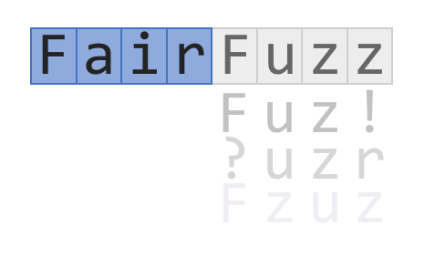

# FairFuzz

 

An AFL extension to increase code coverage by targeting rare branches. FairFuzz has a particular advantage on programs with highly nested structure (packet analyzers, xmllint, programs compiled with [laf-inte](https://lafintel.wordpress.com/), etc). AFL is written and maintained by Michal Zalewski <lcamtuf@google.com>; FairFuzz extension by Caroline Lemieux <clemieux@cs.berkeley.edu>.

Our paper on FairFuzz was [published in ASE 2018](http://www.carolemieux.com/fairfuzz-ase18.pdf). 

## Summary

This is a modified version of [AFL](http://lcamtuf.coredump.cx/afl/) which changes (1) the way in which AFL selects input for mutation and (2) the way in which AFL mutates inputs to target rare "branches" in the program under test. AFL keeps track of program coverage an input achieves by counting the number of times the input hits a _Basic Block Transition_ (see [AFL technical details](http://lcamtuf.coredump.cx/afl/technical_details.txt) for more detail). This basic block transition can be loosely associated with a branch in the control flow graph, thus we call refer to these transitions as _branches_.

On many benchmarks, this modification achieves faster branch coverage than AFL or AFLFast. The advantage seems particularly strong on programs structured with many nested conditional statements. The graphs below show the number of basic block transitions covered over 24 hours on 9 different benchmarks. Each run was repeated 20 times (one fuzzer only): the dark middle line is the average coverage achieved, and the bands represent 95% confidence intervals.

Evaluation was conducted on on AFL 2.40b. All runs were done with no AFL dictionary: the emphasis on rare branches appears to yield better automated discovery of special sequences. On the `tcpdump` and `xmllint` benchmarks, FairFuzz was able to discover rare sequences over the 20 runs, which the other techniques did not discover. Over these 20 techniques each different technique, the number of runs finding portions of the sequence `<!ATTLIST` after 24 hours was:

| subsequence | AFL | FidgetyAFL | AFLFast.new | FairFuzz|
| ------ | --------: | --------: | --------: | --------: |
| `<!A` |  7 | 15 | 18| 17|
| `<!AT` |  1 | 2 | 3| 11|
| `<!ATT` |  1 | 0 | 0| 1|

More details in [article](http://www.carolemieux.com/fairfuzz-ase18.pdf).

## Technical Summary

### What is a rare branch?

We consider a branch to be _rare_ if it is hit by fewer inputs than the other branches explored so far. We maintain a dynamic threshold for rarity: if a branch is hit by fewer inputs than (or exactly as many as) this threshold, it is rare. Precisely, the threshold is the lowest power of two bounding the number of inputs hitting the least-hit branch. For example, if the branch hit by the fewest inputs is hit by 19 inputs, the threshold will be 32, so any branch hit by ≤32 inputs will be rare. Once the rarest branch is hit by 33 inputs, the threshold will go up to 64. 

To keep track of rarity information, after running every input, we increment a hit count for each branch. 

### How are inputs hitting rare branches selected?

When going through the queue to select inputs to mutate, FairFuzz selects inputs only if -- at the time of selection -- they hit a rare branch. The rare branch an input hits is selected as the _target branch_. If an input hits multiple rare branches, FairFuzz selects the rarest one (the one hit by the fewest inputs) as the target branch. If an input hits no rare branches, it is skipped (see the `-q` option below).

### How are mutations targeted to a branch?

Once an input is selected from the queue, along with its designated target branch, FairFuzz computes a _branch mask_ for the target branch. For every position in the input, the branch mask designates whether
1. the byte at that position can be overwritten (overwritable),
2. the byte at that position can be deleted (deleteable), or
3. a byte can be inserted at that position (insertable),

while still hitting the target branch. FairFuzz computes an approximation to this branch mask dynamically, in a way similar to AFL's effector map. FairFuzz goes through the input, and at each position flips the byte, deletes the byte, or inserts a byte, then runs the mutated input to check whether it hits the target branch. If the mutated input hits the target branch, the position is marked as overwritable, deleteable, or insertable, respectively.

The branch mask is then used to influence mutations as follows:
1. In the deterministic stages[1](#footnote1), a mutation is only performed at a location if the branch mask designates the position as overwritable (or insertable, for dictionary element insert). For multi-byte modifications, a modification is only performed if all bytes are overwritable. The mask is used in conjunction with the effector map when the effector map is used.
2. In the havoc stage, positions for mutations are randomly selected _within the modifiable positions of the branch mask_. For example, if bytes 5-10 and 13-20 in a 20-byte input can be overwritten without failing to hit the target branch, when randomly selecting a byte to randomly mutate, FairFuzz will randomly select a position in [5,6,7,8,9,10,13,...,20] to mutate. After a havoc mutation that deletes (resp. adds) a sequence of bytes in the input, FairFuzz deletes the sequence (resp. adds an "all modifiable" sequence) at the corresponding location in the branch mask.[2](#footnote2) The branch mask becomes approximate after this point.

<a name="footnote1">1</a> <small>The mask is not used in the bitflipping stage since this would interfere with AFL's automatic detection of dictionary elements. </small>

<a name="footnote2">2</a> <small>The mask is not used to determine where to splice inputs in the splicing stage: during splicing, the first part of the branch mask is kept, but the spliced half of the input is marked as all modifiable.</small>

## Usage summary

For basic AFL usage, see the [README](https://github.com/carolemieux/afl-rb/blob/master/docs/README) in `docs/` (the one with no .md extension). There are four FairFuzz Rare Branches-specific options:

*Running options* (may be useful for functionality):
- `-r` adds an additional trimming stage before mutating inputs. This trimming is more aggressive than AFL's, trimming the input down only according to the target branch -- the resulting trimmed input may have a different path than the original input, but will still hit the target branch. Recommended for use if there are very large seed files and deterministic mutations are being run.
- `-q num` bootstraps the rare branch input selection from the queue with the regular AFL input selection mechanism. If after an entire cycle through the queue, no new branches are discovered, bootstrap according to `num` as follows:
  - `-q 1` go back to regular AFL queueing + no branch mask on mutations until a new branch is found
  - `-q 2` go back to regular AFL queueing + no branch mask on mutations + no deterministic mutations until a new branch is found
  - `-q 3` go back to regular AFL queueing + no branch mask on mutations for a single queueing cycle

*Evaluation options* (mostly useful for comparing AFL versions):
- `-b` disables the branch mask. (sets every position in the mask as modifiable -- will incur unnecessary slowdown compared to AFL) 
- `-s` runs a "shadow" mutation run before the branch-mask enabled run. Side effects are disabled in this run. This allows for direct comparison of the effect of the branch mask on new coverage discovered/number of inputs hitting the target branch. See `min-branch-fuzzing.log` produced in the AFL output directory for details.
